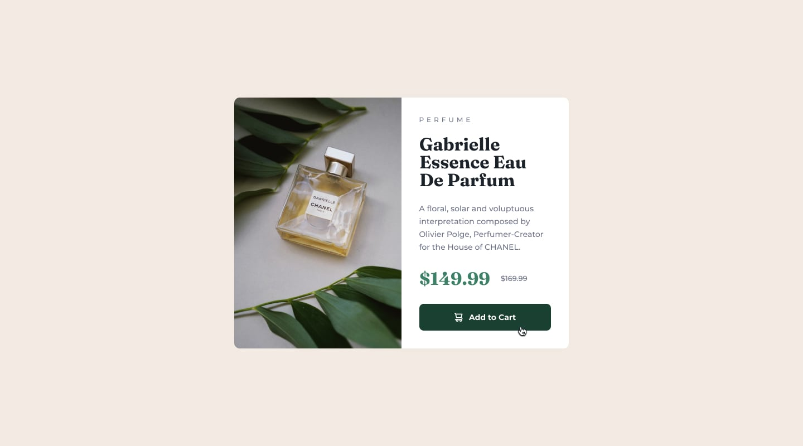

# Product Preview Card Component (Frontend Mentor challenge)

This is my solution to the Product Preview Card Component challenge from Frontend Mentor. I'm still learning HTML and CSS (working through Flexbox right now), so this was mostly a practice project to actually use what I've been learning instead of just watching tutorials.

## Screenshot

## Live Site / Repo

- Live Site: [add link here once deployed]
- Repo: [add link here]

## Built with

- HTML5
- CSS (Flexbox, media queries)
- Google Fonts - Montserrat + Fraunces

## What I learned / struggled with

Honestly this took a lot longer than I expected for what looks like a simple card. Here's some of what I figured out along the way:

**flex: 1**

I didn't get why my image and text weren't sitting side by side at first, turns out I had the class on the wrong element (put it on the `div` instead of the `img` itself, lol). Once I gave both the image div and the content div `flex: 1`, they split the space evenly and sat next to each other without me having to do any width math.

**object-fit: cover**

My image looked stretched and weird when I first got it to size down. Setting width and height to 100% on its own doesn't keep the picture's proportions, it just stretches it to whatever shape the box is. Adding `object-fit: cover` fixed it — it crops the image to fit instead of squishing it.

**Using a different image for mobile**

I didn't know you could swap images based on screen size until this project. Used the `<picture>` tag with a `<source>` for mobile and a regular `` as the fallback:

<picture>
  <source media="(max-width: 600px)" srcset="./images/image-product-mobile.jpg">
  
</picture>

**Flexbox everywhere, not just once**

This was probably the biggest thing I picked up. I thought Flexbox was just "the thing you use once to make the layout." Turns out I ended up using it like 4 different times in this one small component:
- on the body, to center everything on the page
- on the container, to split image and text side by side
- on the price row, just to line up the price and the crossed-out old price next to each other

Didn't expect the same couple of properties (display: flex, align-items, gap) to be useful in so many different spots at totally different scales.

**Media query for mobile**

css
@media (max-width: 600px) {
  .container {
    flex-direction: column;
    max-width: 17rem;
  }
}

Just setting flex-direction to column was enough to stack everything for mobile, which felt kind of anticlimactic honestly, I was expecting to need way more code.

## Author

Eziokwu Henry Nnaemeka

Frontend Developer & Cybersecurity Student
https://elcracky21.github.io/Product-Preview-Card/

## Acknowledgements

This project was built as part of the
[Frontend Mentor](https://www.frontendmentor.io/) Product-preview-card challenge.
